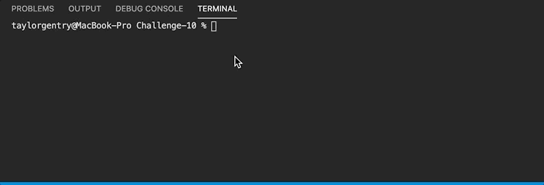

# Team Profile Generator


## 💬 Description 
A program built with Node.js that prompts a user for input (team name, team members, roles, emails, etc.) and generates an HTML file based on the given information.


## 📓 Table of Contents

* [User Story](#user-story)
* [Acceptance Criteria](#acceptance-criteria)
* [Mock-Up](#mock-up)
* [Installation](#installation)
* [Usage](#usage)
* [Built With](#built-with)
* [License](#license)
* [Badges](#badges)
* [Contributing](#contributing)
* [Tests](#tests)
* [Questions](#questions)


## 🧠 User Story
```
AS A manager
I WANT to generate a webpage that displays my team's basic info
SO THAT I have quick access to their emails and GitHub profiles
```


## 🧩 Acceptance Criteria
```
GIVEN a command-line application that accepts user input
WHEN I am prompted for my team members and their information
THEN an HTML file is generated that displays a nicely formatted team roster based on user input
WHEN I click on an email address in the HTML
THEN my default email program opens and populates the TO field of the email with the address
WHEN I click on the GitHub username
THEN that GitHub profile opens in a new tab
WHEN I start the application
THEN I am prompted to enter the team manager’s name, employee ID, email address, and office number
WHEN I enter the team manager’s name, employee ID, email address, and office number
THEN I am presented with a menu with the option to add an engineer or an intern or to finish building my team
WHEN I select the engineer option
THEN I am prompted to enter the engineer’s name, ID, email, and GitHub username, and I am taken back to the menu
WHEN I select the intern option
THEN I am prompted to enter the intern’s name, ID, email, and school, and I am taken back to the menu
WHEN I decide to finish building my team
THEN I exit the application, and the HTML is generated
```

## 🎨 Mock-Up


## 🔌 Installation
The user should clone the repository from GitHub and open up the project in their code editor.
<br>User will need to run node.js and perform an npm install for all necessary modules listed below.</br>


## 💻 Usage 
Please run command _node index.js_.
<br>[Click me for walkthrough❗️](https://drive.google.com/file/d/1KapztHhk4d70i89yPy8xY-UeZX8Ts1Rh/view)</br>
<br></br>
<br></br>


## ✏️ Built With

<p><a href="https://nodejs.org/">Node.js</a></p>
<p><a href="https://www.npmjs.com/">NPM</a></p>
<p><a href="https://www.npmjs.com/package/inquirer">Inquirer</a></p>
<p><a href="https://jestjs.io/">Jest</a></p>
<p><a href="https://fonts.google.com/">Google Fonts</a></p>


## 🔐 License
```
Copyright © MIT. All rights reserved. 
Licensed under the MIT license.
```


## 🏆 Badges


<br></br>

<br></br>


## 📌 Contributing

Taylor Gentry ©2020 All Rights Reserved.


## 📊 Tests

To test this project, please see the [Installation](#installation) section - then run command _npm run test_.
<br>This program was build using class syntax and constructor functions. The functions were tested before building out the remainder of the program.</br> 
<br></br>


## ❓ Questions
If you have any questions about this projects, please contact me directly at tpgent01@outlook.com. 
<br>You can view more of my projects at https://github.com/tpgent01 👾</br>
